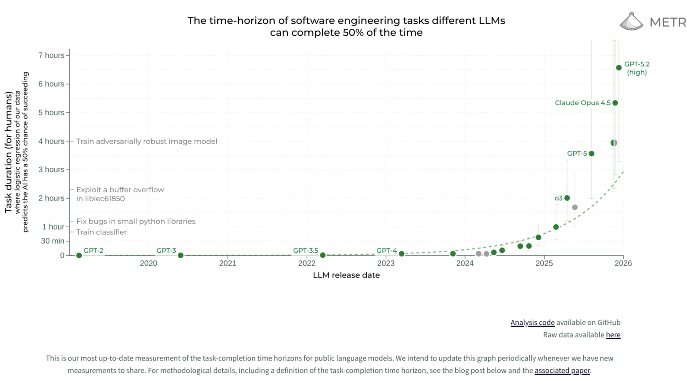

Тази графика ме притеснява.

Публикувана е от METR и показва колко сложни софтуерни задачи могат да решават AI моделите - измерени в часове, които на човек биха му отнели.

⚠️ Но ето какво пропускат повечето хора: това НЕ е графика само за програмисти.

Софтуерното инженерство е просто най-лесното нещо за измерване. Имаш ясен вход, ясен изход, можеш да пуснеш benchmark. Затова METR го мерят.

Кривата е видимо експоненциална.

- GPT-2 (2019) - нула. Буквално нищо.
- GPT-4 (2023) - минути.
- Claude Opus 4.5 и GPT-5 - 3 до 5 часа сложна инженерна работа.
- GPT-5.2 (high) - вече 7 часа.

За по-малко от две години скочихме от "оправя дребни бъгове" до задачи, за които наемаш senior developer.

Зад тази крива стои нещо по-фундаментално - способността на AI да изпълнява сложни, многостъпкови задачи, които изискват разсъждение, планиране и изпълнение.

Това е същата способност, която ти трябва за:

- Анализ на финансови отчети
- Изготвяне на маркетингова стратегия
- Писане и редакция на правни документи
- Подготовка на учебни програми
- Управление на проекти

Експоненциалната крива не е за кода. Тя е за когнитивната работа изобщо.

- През 2023 повечето хора казваха "AI е hype".
- През 2024 казваха "ОК, интересно е, но не е за мен".
- През 2025 казваха "Чатя си с него, но не знам как да го ползвам за работа".
- Сега сме 2026 и кривата вече навлиза в територия, в която AI свършва за часове неща, за които плащаш на специалист хиляди.

А в България?
Този бърз темп ме притеснява, защото повечето фирми все още дебатират дали да пуснат ChatGPT/Gemini на служителите си и дали планът за 20€/10€ си заслужава и ще се избие. А те е трябвало отдавна да са започнали да го ползват.

Непопулярното ми мнение: до края на 2026 компаниите, които не са интегрирали съществено AI в ежедневните си процеси, ще изглеждат като вестникарските компании, които имаха уебсайт, но продължаваха да залагат на хартията. Технически присъстваха онлайн. Практически умираха бавно.